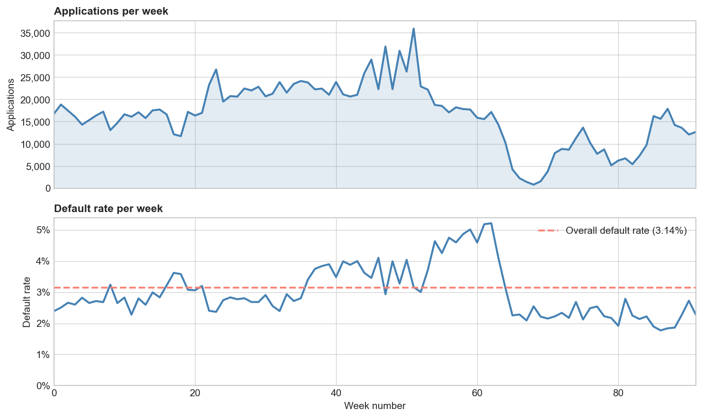
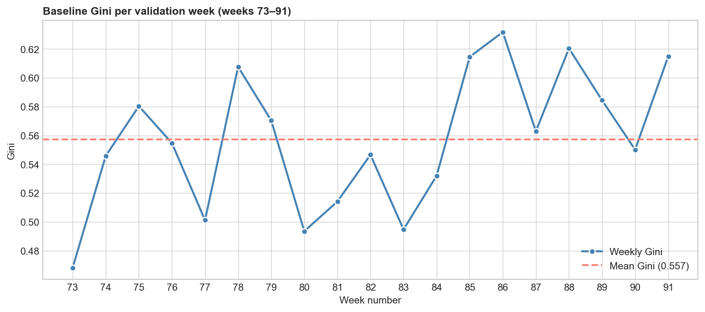

# Credit Default Risk

Loan default prediction on the [Home Credit — Credit Risk Model Stability](https://www.kaggle.com/competitions/home-credit-credit-risk-model-stability) Kaggle dataset. About 1.5M applications over 92 weeks, 3.14% default rate.

The metric is the interesting part here. You get scored on Gini, but with a penalty if performance decays over the weeks. That makes it a drift problem more than a leaderboard problem, and much closer to how credit models actually get judged in production than the usual random split.



*Volume and default rate both drift a lot over the 92 weeks — the weekly default rate swings from under 2% to over 5%. This is the whole reason the metric cares about stability.*

## Notebooks

| Notebook | What's in it |
|---|---|
| [`01_initial_eda.ipynb`](notebooks/01_initial_eda.ipynb) | First look at the data: target drift, missingness, what correlates with default, coverage of the depth-1 tables |
| [`02_base_model.ipynb`](notebooks/02_base_model.ipynb) | LightGBM baseline on the 53 numeric static columns, out-of-time split, stability-adjusted Gini |
| [`03_feature_engineering.ipynb`](notebooks/03_feature_engineering.ipynb) | Ratio features plus aggregations from the depth-1 tables, measured against the baseline |

The stability metric, temporal split and feature selection live in [`src/credit_risk`](src/credit_risk), so every notebook uses the exact same ones. Tests included.

## Results

| Metric | Baseline (02) | + Engineered features (03) |
|---|---|---|
| Validation AUC | 0.783 | **0.806** |
| Validation Gini | 0.566 | **0.613** |
| Stability score | 0.537 | **0.587** |

44 engineered features buy about +2.3 AUC points and +5 stability points, on the same split and identical LightGBM params. Eight of the model's top 20 features by gain are engineered ones — the payment-burden ratio and the previous-application reject rate come in at #2 and #3.



*Baseline Gini per held-out week: noisy (0.47–0.63) but not falling, so no stability penalty.*

The strongest raw signal is days-past-due history. Applicants with any DPD in the last 9 months default at 6.7%, vs 2.2% for everyone else.

## Setup

```bash
python -m venv .venv && source .venv/bin/activate
pip install -r requirements.txt
pip install -e .   # the credit_risk helpers the notebooks import
```

The data isn't committed (it's ~25 GB). Grab it from the [competition page](https://www.kaggle.com/competitions/home-credit-credit-risk-model-stability/data) and unpack it so the parquet files land here:

```
data/
└── parquet_files/
    ├── train/
    └── test/
```

Then run the notebooks from `notebooks/`. `pytest` runs the package tests.
# credit-default-risk-autoencoder
